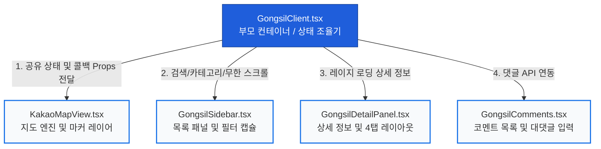

# 🏗️ [Refactoring Plan] GongsilClient.tsx 대규모 컴포넌트 구조 고도화 설계안
> **작성일:** 2026년 5월 26일  
> **대상:** `src/app/(map)/gongsil/GongsilClient.tsx` (현재 3,722줄)  
> **목적:** 가독성 10배 향상, 0ms 실시간 렌더링 유지, 컴포넌트별 책임 분리(Single Responsibility) 및 유지보수 효율화  

---

## 🎨 1. 이상적인 컴포넌트 분할 구조도

대형 모놀리식 파일을 상태를 관리하는 **부모 컨테이너(Orchestrator)**와 화면을 그리는 **4개의 자식 컴포넌트(Presenters)**로 깔끔하게 나눕니다.



---

## 📂 2. 컴포넌트 역할 정의 및 세부 설계

### ① 👑 부모 컨테이너: `GongsilClient.tsx` (약 350줄로 다이어트)
* **역할**: 애플리케이션의 **단일 진실 공급원(Single Source of Truth)**. 모든 컴포넌트가 공유하는 전역 상태와 서버 액션 통신을 집중 관리합니다.
* **주요 상태(State)**:
  * `dbVacancies`: 로드된 전체 매물 배열
  * `activeProperty`: 현재 선택된 매물 ID
  * `wishlist`: 관심 목록 배열
  * `filters` (카테고리, 가격대, 관리비, 층수 등 필터 상태 그룹)
* **주요 기능**: Supabase API 호출 및 탭 전환 상태 조율.

---

### ② 🗺️ 지도 렌더러: `KakaoMapView.tsx` (약 700줄)
* **역할**: 카카오 맵 API 인스턴스 통제 및 고성능 렌더링 레이어.
* **전달받는 Props**:
  ```typescript
  interface KakaoMapViewProps {
    vacancies: VacancyType[];
    activeProperty: string | null;
    onSelectProperty: (id: string | null) => void;
    mapBounds: any;
    setMapBounds: (bounds: any) => void;
    isAuctionMode: boolean;
  }
  ```
* **주요 기능**:
  * Kakao Map 객체 초기화 및 Refs 관리.
  * 줌 레벨(`Level <= 5`)에 따른 고성능 금액 사각형 핀/통계 서클 조건부 렌더링.
  * 클러스터러 동적 업데이트 및 성능 병목 방지용 줌체인지 `Early Return` 최적화 로직 탑재.

---

### ③ 📋 사이드바 & 목록 렌더러: `GongsilSidebar.tsx` (약 600줄)
* **역할**: 좌측 매물 목록 패널, 카테고리 탭, 8대 플랫 필터 버튼 렌더링.
* **전달받는 Props**:
  ```typescript
  interface GongsilSidebarProps {
    vacancies: VacancyType[];
    activeProperty: string | null;
    onSelectProperty: (id: string | null) => void;
    filters: FilterState;
    onChangeFilters: (newFilters: FilterState) => void;
  }
  ```
* **주요 기능**:
  * 8대 캡슐 필터 버튼 및 가로 스와이프 스크롤 구현.
  * **30개 단위 무한 스크롤(Paging) 및 "더보기"** 렌더링 인터랙션 처리 (DOM 최적화 핵심부).

---

### ④ 🏢 상세 정보창: `GongsilDetailPanel.tsx` (약 800줄)
* **역할**: 매물 선택 시 중앙에 슬라이딩되는 고급 4탭 상세 대조 레이아웃.
* **전달받는 Props**:
  ```typescript
  interface GongsilDetailPanelProps {
    propertyId: string;
    onClose: () => void;
    wishlist: string[];
    onToggleWishlist: (id: string) => void;
  }
  ```
* **주요 기능**:
  * `trade_type === '경매'` 조건에 따른 전용 4개 탭 분기 렌더링.
  * 감정가, 최저입찰가, 기일 디데이, 토지/건물 면적 스펙의 깔끔한 그리드 표기.
  * 갤러리 이미지 클릭 시 풀스크린 줌/갤러리 모달 제어.

---

### ⑤ 💬 댓글 처리기: `GongsilComments.tsx` (약 250줄)
* **역할**: 상세 패널 최하단에 위치하는 비밀 댓글 및 대댓글(Reply) 시스템 격리.
* **주요 기능**: 댓글 페이징 처리, 대댓글 대상 지정 및 인풋 포커스 제어.

---

## 📈 3. 리팩토링 단계별 로드맵 (Risk-Free Strategy)

한꺼번에 뜯어고치면 사이트가 멈추는 에러가 발생할 수 있으므로, **기존 기능을 100% 보존하면서 한 단계씩 격리 추출하는 안전 분할 전략**을 취합니다.

```
[Phase 1] 상수/타입 격리 ➡️ [Phase 2] 상세 패널 분리 ➡️ [Phase 3] 사이드바 분리 ➡️ [Phase 4] 지도 엔진 격리
```

### 📍 [Phase 1] 공통 타입 및 유틸리티 분리 (1일차)
* `GongsilClient.tsx` 상단에 지저분하게 널려 있는 한국어 주소 정제 정규식, 카테고리 설정(`CATEGORY_CONFIG`), 금액 포맷팅 함수(`formatAmount`)들을 `utils/gongsilHelper.ts` 파일로 먼저 분리하여 코드 500줄을 단숨에 줄입니다.

### 📍 [Phase 2] 상세 패널(`GongsilDetailPanel`) 추출 (2일차)
* 가장 덩치가 크고 독립적인 JSX 카드 덩어리인 상세 탭 뷰를 먼저 `GongsilDetailPanel.tsx`로 추출합니다.
* 부모 컴포넌트와 오직 `propertyId` 및 닫기 콜백만 연결하면 되므로 가장 난이도가 낮고 안정적인 격리 지점입니다.

### 📍 [Phase 3] 사이드바 패널(`GongsilSidebar`) 추출 (3일차)
* 필터링 연산 로직(`useMemo` 기반의 검색 결과 도출)은 부모 컨테이너에 남겨두고, 사이드바는 완성된 `displayVacancies` 배열과 무한 스크롤 상태만 전달받아 출력하는 순수 컴포넌트(Presentational Component)로 뽑아냅니다.

### 📍 [Phase 4] 지도 오버레이(`KakaoMapView`) 결합 해제 (4일차)
* 카카오 맵 스크립트 로드 상태와 지도 인스턴스(`kakaoMapRef`)를 독립된 컴포넌트로 이식합니다. 부모와는 좌표 동기화만 수행하게 만들어, 리팩토링의 정점을 완성합니다.

---

## 💎 4. 기대 효과 및 비즈니스 가치
1. **서버 개발/수정 렉 소멸**: 파일 용량이 258KB에서 컴포넌트별 40KB 수준으로 경량화되어, 개발자가 코드를 수정할 때 VS Code가 버벅거리지 않고 화면 핫리로드(Hot Reload)가 **0.1초** 만에 완료됩니다.
2. **이슈 범위 격리 (샌드박스화)**: "댓글창이 작동을 안 해요"라는 제보를 받으면 전체 3,700줄을 헤맬 필요 없이 단 250줄짜리 `GongsilComments.tsx`만 가볍게 열어서 고치면 되므로 버그 해결 속도가 5배 빨라집니다.
3. **독립적 컴포넌트 재사용**: 향후 모바일 전용 공실열람 페이지나, 메인 홈화면에 "오늘의 경공매 추천 매물 지도 카드"를 넣고 싶을 때, 우리가 떼어낸 `KakaoMapView`나 `GongsilSidebar` 컴포넌트를 그대로 복사해서 재사용할 수 있어 신규 피처 개발 비용이 거의 0원으로 수렴합니다.
